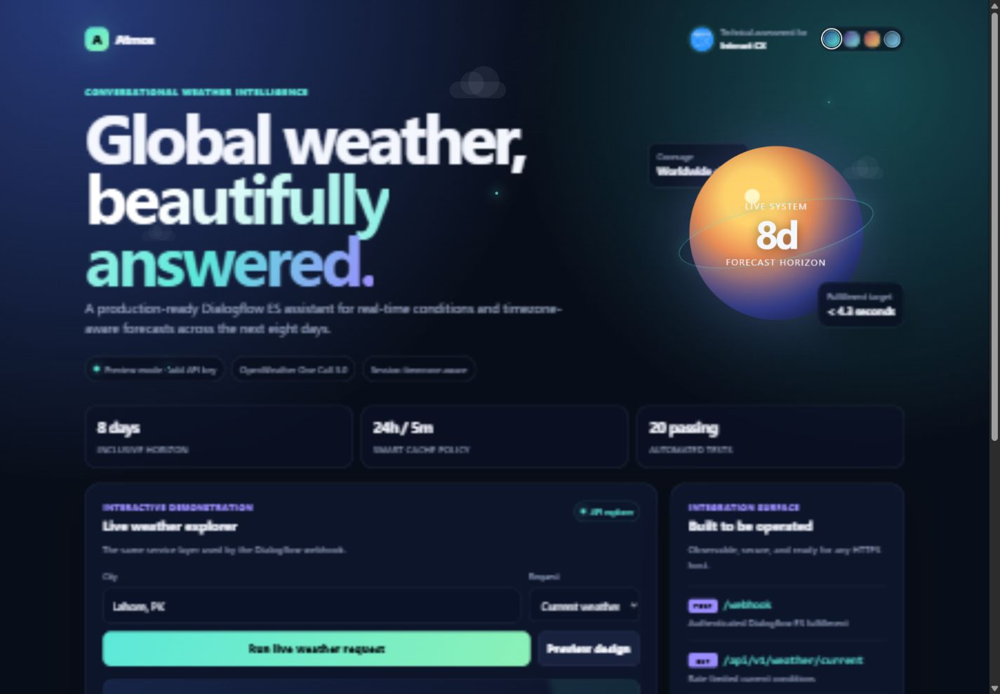
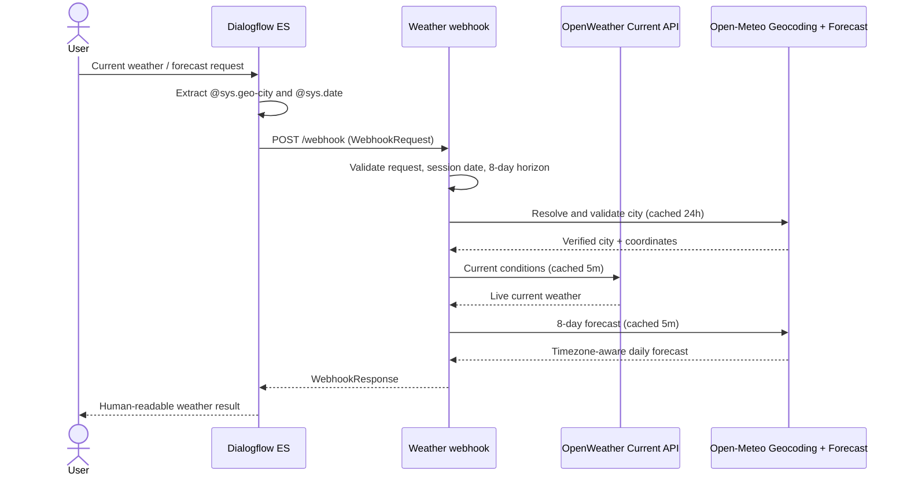

# Dialogflow ES Weather Info & Forecast Bot

A submission-ready Google Dialogflow ES agent and REST fulfillment service that returns current weather for any city and daily forecasts across an eight-day horizon.



The project is deliberately easy to review and operate: it has no third-party runtime dependencies, starts with one command, exposes health checks and an OpenAPI document, protects secrets in logs, and includes an importable Dialogflow agent plus a polished demo dashboard.

The branded dashboard includes animated weather graphics, current and forecast cards, Interact CX assessment context, and four persistent themes: Midnight, Aurora, Sunrise, and Storm.

## What the evaluator can test

- **Current weather:** “What is the current weather?” → bot asks for a city → “My city is Lahore.”
- **Forecast:** “Please tell me the weather forecast from tomorrow for London.”
- **Date rules:** today through seven days after today are accepted, giving an inclusive eight-day window.
- **Conversation close:** “Thanks” → follow-up question → “No thanks” → goodbye.
- **Direct REST demo:** open the deployed base URL and use the built-in API explorer.

## Architecture



The default request path is `Dialogflow ES → HTTPS webhook → Open-Meteo city validation → OpenWeather free Current Weather API + Open-Meteo eight-day forecast`. It requires no paid subscription. An optional `OPENWEATHER_ONE_CALL_ENABLED=true` mode remains available for evaluators who already have a separately activated One Call subscription.

## Repository contents

| Path | Purpose |
|---|---|
| `src/` | REST API, Dialogflow fulfillment, time-zone/date logic, weather-provider clients, formatting, logging |
| `dialogflow-agent/` | Editable Dialogflow ES export source |
| `dist/Weather-Info-Forecast-Bot.zip` | Importable Dialogflow ES agent generated from the source above |
| `public/` | Live operations dashboard and API explorer |
| `test/` | Unit tests for date limits, session timezone, fulfillment, caching, and provider errors |
| `docs/` | Setup, demo narration, requirements traceability, and submission checklist |
| `openapi.yaml` | OpenAPI 3.1 contract for webhook, weather, and health endpoints |

## Quick start

Prerequisites: Node.js 20+ and a free OpenWeather API key. No paid weather subscription is required.

```bash
cp .env.example .env
# Put the free key in .env as OPENWEATHER_API_KEY.
# Keep OPENWEATHER_ONE_CALL_ENABLED=false and OPEN_METEO_FALLBACK=true.
npm install
npm test
npm start
```

The included start script loads a local `.env` file when present. Values already set by your shell or hosting platform take precedence:

```bash
npm start
```

Open `http://localhost:8080`. Readiness changes to green when the API key is available.

### Local webhook test

```bash
curl -X POST http://localhost:8080/webhook \
  -H "Content-Type: application/json" \
  -d '{
    "session":"projects/demo/agent/sessions/local-test",
    "queryResult":{
      "action":"weather.current",
      "parameters":{"city":"Lahore"},
      "languageCode":"en",
      "intent":{"displayName":"Weather - Current"}
    },
    "originalDetectIntentRequest":{"payload":{"timeZone":"Asia/Karachi"}}
  }'
```

## Dialogflow ES setup

1. Open the Dialogflow ES console and create an agent with English as the default language.
2. Open **Settings → Export and Import → Restore from ZIP** and select `dist/Weather-Info-Forecast-Bot.zip`.
3. Open **Fulfillment**, enable Webhook, and enter `https://YOUR-HOST/webhook`.
4. If `WEBHOOK_SECRET` is set on the API, add a fulfillment header named `x-webhook-secret` with the same value.
5. Save. The imported **Weather - Current** and **Weather - Forecast** intents already have webhook fulfillment enabled.
6. Wait for agent training to finish, then run the conversations from the first section in Dialogflow's right-hand test console.

Dialogflow export files intentionally do not contain a deployment URL or secret. Those values are account-specific and must be configured after deployment.

## Deploy to Railway

1. Push this repository to a public GitHub repository.
2. In Railway, choose **New Project → Deploy from GitHub repo**.
3. Add `OPENWEATHER_API_KEY`, keep `OPENWEATHER_ONE_CALL_ENABLED=false`, and optionally add `WEBHOOK_SECRET`, `DEFAULT_TIME_ZONE`, and `WEATHER_UNITS` under Variables.
4. Railway uses the included `Dockerfile`, listens on its injected `PORT`, and checks `/healthz`.
5. Generate a public domain and use `https://YOUR-DOMAIN/webhook` in Dialogflow Fulfillment.

The same container works on Render, Fly.io, Cloud Run, or any Node/Docker host with HTTPS. For a temporary local demonstration, run the service and expose port 8080 using ngrok.

## API endpoints

| Method | Route | Description |
|---|---|---|
| `POST` | `/webhook` | Dialogflow ES `WebhookRequest` → `WebhookResponse` |
| `GET` | `/api/v1/weather/current?city=Lahore` | Normalized current conditions |
| `GET` | `/api/v1/weather/forecast?city=London&date=YYYY-MM-DD&timeZone=Europe/London` | Forecast from the requested date to the eight-day horizon |
| `GET` | `/healthz` | Process liveness |
| `GET` | `/readyz` | Configuration readiness |
| `GET` | `/metrics` | Non-sensitive request, provider, cache, and circuit-breaker telemetry |
| `GET` | `/openapi.yaml` | Complete OpenAPI 3.1 document |

## Date and session-time behavior

Dialogflow normalizes `@sys.date` values before the request reaches the webhook. The API also derives “today” from the integration's session payload when a valid IANA time zone is present (`originalDetectIntentRequest.payload.timeZone` and common platform variants). It falls back to `DEFAULT_TIME_ZONE`, matching the Dialogflow agent's default of UTC unless configured otherwise.

The inclusive supported window is today through today + 7 days. This yields exactly eight calendar days. A requested start date is filtered from the provider data and the response ends at the eight-day horizon.

## Reliability and security choices

- Upstream calls are bounded below Dialogflow ES's five-second webhook deadline and retried once only for timeouts, rate limits, and server errors.
- Geocoding is cached for 24 hours and weather for five minutes to reduce latency and API usage.
- API keys stay server-side and the logger recursively redacts known credential fields.
- City resolution honors country/state qualifiers and rejects low-confidence gazetteer entries that are not recognized cities; every response returns the interpreted location.
- Optional constant-time webhook secret verification prevents unauthenticated fulfillment calls.
- Per-client endpoint limits return standard HTTP 429 responses with `Retry-After` metadata.
- Provider-specific circuit breakers fail quickly during incidents and automatically probe for recovery.
- Versioned `/api/v1/weather/*` routes are available; the original paths remain compatible.
- The zero-cost default uses Open-Meteo for strict city resolution and the
  eight-day forecast, with OpenWeather for live current conditions.
- Paid OpenWeather One Call requests are disabled by default and are made only
  when `OPENWEATHER_ONE_CALL_ENABLED=true` is deliberately configured.
- Webhook failures return a valid Dialogflow text response with HTTP 200 so users receive a useful message instead of a generic fulfillment error.
- Request bodies are capped at Dialogflow's 64 KiB webhook response/request scale.
- Graceful shutdown, health probes, structured JSON logs, input encoding, and security headers are included.

## Verification

```bash
npm run check
npm test
```

The tests use mocked weather-provider responses, so they do not consume API quota or require credentials. A live smoke test is documented in `docs/SETUP.md`.

## Submission assets

- Use `docs/DEMO_SCRIPT.md` for the required voiceover recording.
- Use `docs/SUBMISSION_CHECKLIST.md` before emailing the submission.
- Use `docs/ASSESSMENT_TRACEABILITY.md` to show where each line of the assessment is implemented.
- Use `docs/SECURITY.md` for the backend threat boundaries and production controls.

## Known external steps

The remaining account-owned steps are deploying into a hosting account, entering the final webhook URL in Dialogflow, recording a human voiceover, and sending the submission email. Everything needed for those steps is prepared here.
